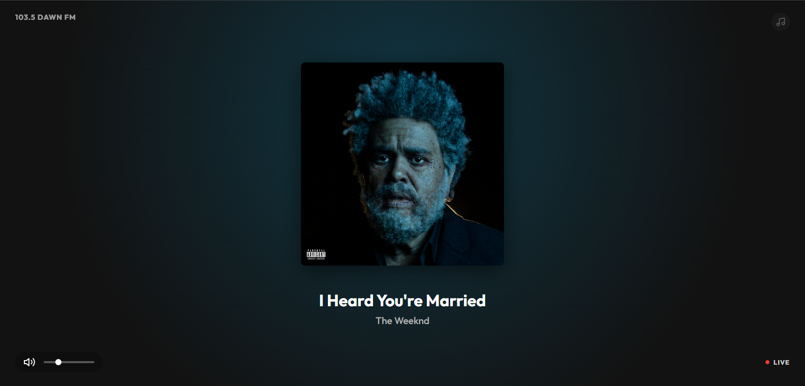

# 103.5 Dawn FM Radio 📻

> *You are now listening to 103.5 Dawn FM. You've been in the dark for way too long. It's time to walk into the light and accept your fate with open arms.*

A sophisticated, globally synchronized live radio station web application dedicated to The Weeknd's *Dawn FM*.



## 🌟 Key Features

### 🎧 "Virtual DJ" Streaming Engine
Unlike standard file servers, this project implements a custom **Time-Based Streamer**:
-   **No Buffering Drift**: The server sends audio chunks corresponding *exactly* to the current millisecond.
-   **Anti-Runaway**: Clients cannot buffer minutes ahead; the stream acts like a live radio broadcast.
-   **Instant Tune-In**: Refreshing the page snaps you immediately to the live moment, not the start of a buffered segment.

### 🔄 Global Synchronization
-   **Server-Side Clock**: The playlist state is maintained by the server's uptime.
-   **Seamless Looping**: The broadcast loops infinitely with perfect transition logic.
-   **State Persistence**: Playback position is saved to disk, so the radio station "keeps playing" even across server restarts.

### 📱 Modern Web Experience
-   **Media Session API**: Fully integrated with OS lock screens, smartwatches, and hardware media keys (`play`, `pause`, `metadata`).
-   **Premium UI**: Full-screen immersive visualizer with dynamic background colors extracted from track art.
-   **Mobile Ready**: "Omni-click" interaction layer ensures audio autoplay policies are handled gracefully on iOS/Android.

## 🛠 Tech Stack

-   **Backend**: Node.js, Express
    -   *Custom `BroadcastController` for precise byte-level audio seeking.*
-   **Frontend**: Vanilla JavaScript (ES6+), CSS3
-   **Audio**: HTML5 Audio Element + Dynamic Stream Source
-   **No Database**: Lightweight JSON file persistence.

## 🚀 Getting Started

### Prerequisites
-   Node.js (v14+)
-   npm

### Installation

1.  Clone the repository:
    ```bash
    git clone https://github.com/danyooooo/103.5-Dawn-FM.git
    cd 103.5-Dawn-FM
    ```

2.  Install dependencies:
    ```bash
    npm install
    ```

3.  **Important**: Place your audio source file.
    -   Rename The Weeknd's *Dawn FM* full album audio file to `master.mp3`.
    -   Place it in `server/data/assets/`.
    *(Note: This repository does not include the copyrighted audio file).*

### Running the Station

Start the server:
```bash
npm start
```
The radio will be live at `http://localhost:3000`.

## 📂 Project Structure

```
103.5-Dawn-FM/
├── public/             # Static frontend assets
│   ├── script.js       # Client Logic (Sync, UI, Media Session)
│   ├── style.css       # Premium CSS styling
│   └── index.html      # Main entry point
├── server/
│   ├── data/
│   │   ├── assets/
│   │   │   └── master.mp3  # Audio file
│   │   ├── offsets.json    # Track timing metadata
│   │   └── state.json      # Persistence file (auto-generated)
│   └── BroadcastController.js # The "Virtual DJ" Engine
├── server.js           # Express App Entry & Routes
└── package.json
```

## 🧩 How It Works

1.  **The Handshake**: Client requests `/sync` to get metadata (current song, time remaining, album art).
2.  **The Stream**: Client connects to `/stream`. The server accepts the connection and begins piping bytes from the exact offset calculated by `(ServerTime % TotalDuration) * ByteRate`.
3.  **The Loop**: When the file ends, the backend streams recursively pipe the file start again, ensuring zero-interruption looping.

## 📄 License
MIT

---
*Disclaimer: This is a fan project. Dawn FM and all associated audio/imagery are property of XO / Republic Records.*
